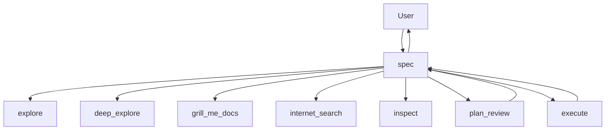

## OpenCode CLIの環境変数参照について
`opencode.nix` で OpenCode の環境変数参照を書くときは、一般的な `${VAR}` ではなく OpenCode の `{env:VAR}` 構文を文字列として使う。

```nix
{
  options = {
    baseURL = "{env:SAKURA_BASE_URL}";
    apiKey = "{env:SAKURA_API_KEY}";
  };
}
```

## Agent構成
Primary agentは`spec`に一本化する。ユーザーが直接対話する主担当は`spec`だけにし、その他のagentは`spec`が必要な場面で呼び出すsubagentとして扱う。

### Primary agent
| agent | 役割 | 主な接続先 |
| --- | --- | --- |
| `spec` | 要件確認、実装計画、ユーザー確認、実装委譲、完了報告を担当する主担当。 | `explore`、`deep_explore`、`grill_me_docs`、`internet_search`、`inspect`、`plan_review`、`execute` |

### Subagent
| agent | 役割 | 編集可否 |
| --- | --- | --- |
| `explore` | 少数ファイルや特定領域を読む調査担当。実装前に現状を確認する。 | 不可 |
| `deep_explore` | 複数モジュールにまたがる構造、依存、慣習を読む広域調査担当。 | 不可 |
| `grill_me_docs` | `grill-me-docs`相当の事前確認担当。`CONTEXT.md`、ADR、docs、関連コードの言葉を確認し、質問、推奨回答、docs更新案、実装境界を`spec`へ返す。 | 不可 |
| `internet_search` | ローカルだけでは判断できない最新仕様、API、慣習を調べるWeb調査担当。 | 不可 |
| `inspect` | `git diff`、`git log`、`git show`、`git status`、`git blame`だけを使う履歴調査担当。 | 不可 |
| `plan_review` | `spec`が作った実装計画を実装前にレビューし、`APPROVE`または`REJECT`を返す。 | 不可 |
| `execute` | 承認済み計画の具体的な実装担当。`spec`から委譲された範囲だけを編集する。 | 可 |

## Agentの関係性
通常の流れは、`spec`が要件を確認し、必要に応じて調査系subagentへ確認を委譲する。設計や言葉が曖昧な場合は`grill_me_docs`を先に使い、docsやコード上の言葉と衝突しない形にそろえる。

実装に進む前に、`spec`は計画を`plan_review`へ渡してレビューを受ける。レビューが通り、ユーザー確認も取れたあとで、`execute`へ実装を委譲する。



使っていないsubagentは設定に残さない。`fast`、`idea`、`review`や、無効化だけされた組み込みagentの上書き定義は削除し、現在の運用で必要なagentだけを`opencode.nix`に置く。
